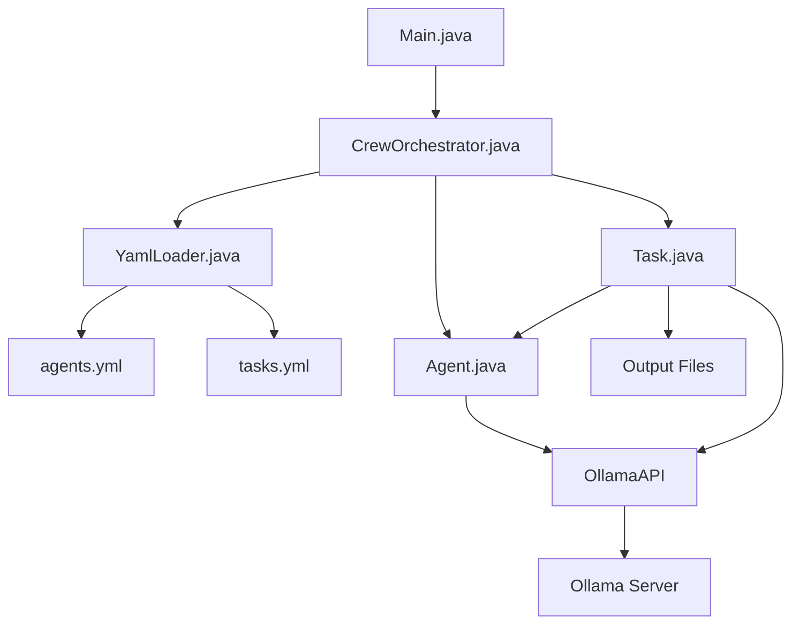

# Ollama Agents in Java

A configurable Java project that leverages [Ollama4J](https://github.com/shibme/ollama4j) to create role-based agents (e.g., Researcher, Reporting Analyst) defined via YAML configurations. 
This setup enables flexible and scalable workflows for tasks such as research and report generation.

## Features

- **Config-Driven Agents and Tasks**: Define agents and tasks using YAML files.
- **Role-Specific Responses**: Agents respond based on their defined roles.
- **Automatic Output Handling**: Save task outputs to specified files.
- **Extensible Architecture**: Easily add new agents and tasks through configuration.

## Requirements
- Java 17+
- Ollama server running (e.g., `ollama serve` on your machine)
- Maven

## Usage
1. before executing/starting make sure that you start the Ollama server:
   ```bash
   ollama serve


